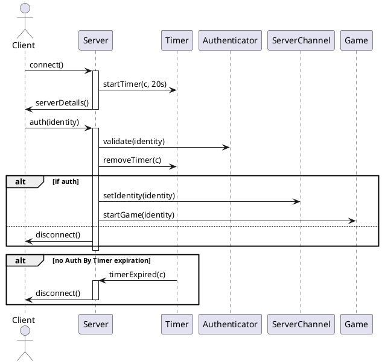

# Net Server

## Connection Details

<!--

```plantuml
@startuml
actor Client as c
participant Server as s
participant Timer as t
participant Authenticator as sa
participant ServerChannel as sc
participant Game as g
c->s: connect()
activate s
s->t: startTimer(c, 20s)
s->c: serverDetails()
deactivate s
c->s: auth(identity)
activate s
s->sa: validate(identity)
s->t: removeTimer(c)
alt if auth
  s->sc: setIdentity(identity)
  s->g: startGame(identity)
else
  s->c: disconnect()
end
deactivate s

alt no Auth By Timer expiration
t->s: timerExpired(c)
activate s
s->c: disconnect()
deactivate s
end
@enduml
```
-->